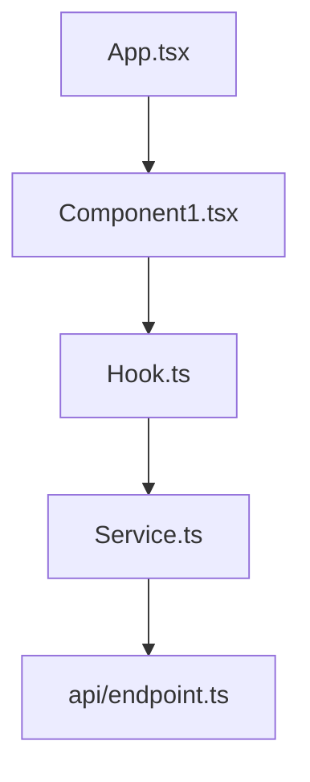

# [Project Name] Implementation Plan

## 📐 Template Scaling Guide

_Choose your template complexity based on project scope_

### 🟢 **Minimal** (single feature, < 5 files)

**Use these sections only:**

- Executive Summary (simplified - just goal & next steps)
- Current Status (just progress bar & checkpoint)
- Architecture Overview (just directory structure)
- Implementation Plan (single phase, acceptance criteria only)
- Code Context & Patterns (reference existing patterns)

### 🟡 **Standard** (multiple features, 5-20 files)

**Add these sections:**

- Quick Context Retrieval
- Decisions Required (if any)
- File Dependency Map
- Implementation Roadmap (2-3 phases)
- Known Gotchas
- Testing Strategy (basic)

### 🔴 **Comprehensive** (full applications, 20+ files)

**Use all sections including:**

- Quick Links
- Full Implementation Details with discoveries
- Technical Decisions Log
- Risk Assessment & Mitigation
- Success Metrics & Quality Gates
- Deployment Plan
- Monitoring & Observability
- Weekly Update Template

### Quick Decision Tree

```
Is this a quick prototype or experiment? → Minimal
Will multiple people work on this? → Standard minimum
Does this go to production? → Standard minimum
Is this business-critical? → Comprehensive
Will this run for > 1 month? → Comprehensive
Does this need compliance/audit trail? → Comprehensive
```

### Section Importance by Project Type

|Section|Prototype|Internal Tool|Production Feature|Enterprise System|
|---|---|---|---|---|
|Executive Summary|✅ Simple|✅ Simple|✅ Full|✅ Full|
|Code Patterns|✅ Reference|✅ Basic|✅ Full|✅ Full|
|Implementation Details|❌ Skip|✅ Basic|✅ Full|✅ Full|
|Testing Strategy|❌ Skip|⚠️ Optional|✅ Required|✅ Required|
|Risk Assessment|❌ Skip|❌ Skip|✅ Required|✅ Required|
|Monitoring|❌ Skip|❌ Skip|⚠️ Optional|✅ Required|
|Decisions Log|❌ Skip|⚠️ Major only|✅ Full|✅ Full|

---

## Quick Context Retrieval

**Project Type**: [React/Next.js/Vue] with [TypeScript/JavaScript]  
**Key Libraries**: [Exact versions matter]

**Environment**:

- **Node Version**: [X.X.X] ([specific features used])
- **Package Manager**: [npm/yarn/pnpm] ([workspace setup if applicable])
- **Browser Targets**: [List with versions]
- **Build Tool**: [Vite/Webpack/etc] with [specific config]

## Quick Links

- 📊 [Project Dashboard](#)
- 🔗 [Live Environment](#)
- 📝 [Original Requirements](#)
- 💬 [Team Discussion Thread](#)
- 🔄 [CI/CD Pipeline](#)
- 📚 [API Documentation](#)

---

## Executive Summary & Current Status

_Front-load the most critical information_

**Project Goal**: [One-sentence description of what you're building]

**Current Status**: [X% complete] | **Last Updated**: [Date] | **Last Updated By**: [Name]

**Next Priority**: [Specific next step with target completion]

### Progress Overview

```
Phase 1: Foundation        ████████████ 100% ✅ Complete
Phase 2: Core Features     ████████░░░░  67% 🚧 In Progress  
Phase 3: Advanced Features ░░░░░░░░░░░░   0% ⏳ Pending
Phase 4: Production Ready  ░░░░░░░░░░░░   0% ⏳ Pending
```

### Key Achievements

- ✅ [Major milestone 1] - [Date]
- ✅ [Major milestone 2] - [Date]
- 🚧 [Current work] - [Expected completion]

### Immediate Next Steps

1. **[Next task]** - [Why it's critical] - [Est. time]
2. **[Following task]** - [Dependencies] - [Est. time]
3. **[Third task]** - [Blockers if any] - [Est. time]

### Session Checkpoint

**Last Action Completed**: [Exact file:line modified]  
**State of System**: [What's running, what's broken]  
**Next Command to Run**: `[specific command]`  
**Open Questions**: [Decisions that need human input]  
**Context for Next Session**: [2-3 sentences of crucial context]

---

## 🚨 Decisions Required

_Flag decisions that need human input before proceeding_

1. **[Decision Topic]**: [Specific choice needed]
    
    - **Context**: [Why this matters]
    - **Options**:
        - Option A: [Description] - Impacts: [consequences]
        - Option B: [Description] - Impacts: [consequences]
    - **Recommendation**: [AI suggestion with reasoning]
    - **DECISION**: ⏳ [Empty for human to fill]
2. **[Decision Topic]**: [Specific choice needed]
    
    - **DECISION**: ⏳ [Pending]

---

## Architecture Overview

_Provide context before diving into details_

### What We're Building

[2-3 sentences describing the feature from user perspective]

### Technical Approach

- **Frontend**: [Technology choices and why]
- **Backend**: [API strategy and data flow]
- **State Management**: [How data flows through the app]
- **Performance Strategy**: [Key optimizations]

### Directory Structure

```
src/
├── [organized by feature/domain]
├── [not by technical layer]
└── [show key files only]
```

### File Dependency Map



**File Creation Order**:

1. `path/to/file1.ts` - [No dependencies]
2. `path/to/file2.ts` - [Depends on: file1.ts]
3. `path/to/file3.tsx` - [Depends on: file1.ts, file2.ts]

---

## Code Context & Patterns

### Established Patterns

```typescript
// State Management Pattern
const useFeatureStore = create<FeatureState>((set) => ({
  data: null,
  loading: false,
  error: null,
  fetchData: async () => {
    set({ loading: true, error: null });
    try {
      const result = await api.getData();
      set({ data: result, loading: false });
    } catch (error) {
      set({ error: error.message, loading: false });
    }
  }
}));

// Error Handling Pattern
const safeApiCall = async <T>(
  apiFunc: () => Promise<T>
): Promise<Result<T>> => {
  try {
    const data = await apiFunc();
    return { success: true, data };
  } catch (error) {
    return { success: false, error: error.message };
  }
};
```

### Naming Conventions

- **Components**: PascalCase (`UserProfile.tsx`)
- **Hooks**: camelCase with 'use' prefix (`useAuth.ts`)
- **Utilities**: camelCase (`formatDate.ts`)
- **Types/Interfaces**: PascalCase with 'I' or 'T' prefix (`IUser`, `TResponse`)
- **Constants**: UPPER_SNAKE_CASE (`API_BASE_URL`)

### Anti-Patterns to Avoid

- ❌ **Don't**: Directly mutate state
    
    ```typescript
    // Wrongstate.users.push(newUser);
    ```
    
- ✅ **Do**: Create new state references
    
    ```typescript
    // CorrectsetState({ users: [...state.users, newUser] });
    ```
    

### Artifact Strategy

**Single Artifact Limit**: Each response contains ONE file/component  
**File Size Thresholds**:

- < 200 lines: Single artifact
- 200+ lines: Split strategy: [Extract hooks → Extract sub-components → Extract utilities]

**Component Boundaries**:

- Max lines per component: 150
- Extract when: Component has 3+ distinct responsibilities
- Splitting approach: [Specific strategy for this project]

---

## Implementation Roadmap

_High-level phase view for context_

### Phase 1: Foundation ✅ COMPLETE

**Goal**: [What this phase achieves]  
**Duration**: [X weeks] | **Completed**: [Date]

- Stage 1.1: [Brief description] ✅
- Stage 1.2: [Brief description] ✅
- Stage 1.3: [Brief description] ✅

### Phase 2: Core Features 🚧 IN PROGRESS

**Goal**: [What this phase achieves]  
**Duration**: [X weeks] | **Progress**: [X/Y stages complete]

- Stage 2.1: [Brief description] ✅
- Stage 2.2: [Brief description] 🚧 **← Currently Here**
- Stage 2.3: [Brief description] ⏳

### Phase 3: Advanced Features ⏳ PENDING

**Goal**: [What this phase achieves]  
**Dependencies**: Phase 2 completion

- Stage 3.1: [Brief description] ⏳
- Stage 3.2: [Brief description] ⏳

### Phase 4: Production Ready ⏳ PENDING

**Goal**: [What this phase achieves]  
**Dependencies**: Phase 3 completion

- Stage 4.1: [Brief description] ⏳
- Stage 4.2: [Brief description] ⏳

---

## Detailed Implementation

### Phase 1: Foundation ✅ COMPLETE

#### Stage 1.1: [Specific Goal] ✅ COMPLETE

**Completion Date**: [Date] | **Duration**: [X days] | **Actual vs Estimate**: [X days vs Y days]

**Context**: Why this stage was necessary and what it enables

**Implementation Summary**:

- ✅ [Key achievement 1] - [Brief technical detail]
- ✅ [Key achievement 2] - [Brief technical detail]
- ✅ [Key achievement 3] - [Brief technical detail]

**Files Created/Modified**:

- ✅ `path/to/file.ts` - [Purpose]
- ✅ `path/to/component.tsx` - [Purpose]

**Acceptance Criteria Met**:

- ✅ User can [specific action] resulting in [specific outcome]
- ✅ API endpoint `/api/resource` returns [specific format] in < 200ms
- ✅ Error state shows [specific message] when [specific condition]

**Implementation Discoveries**:

- **[Date]**: [Key learning that changed approach]
    - **Problem**: [What was expected vs what happened]
    - **Solution**: [How it was resolved]
    - **Future Impact**: [What this means for other stages]

**Technical Debt Incurred**:

- **[Debt item]**: [Why it was necessary] | **Refactor in**: Stage [X.Y] | **Est. effort**: [X hours]

---

### Phase 2: Core Features 🚧 IN PROGRESS

#### Stage 2.2: [Current Goal] 🚧 CURRENTLY IN PROGRESS

**Target Completion**: [Date] | **Progress**: [X% complete] | **Estimated Remaining**: [X days]

**Context**: [Why this stage is important, what it unblocks]

**Current Status**:

- ✅ [Completed subtask] - [Date completed]
- 🚧 [In progress subtask] - [Current blocker/progress]
- ⏳ [Pending subtask] - [Dependency waiting on]

**Acceptance Criteria**:

```typescript
// Test Case 1: [Description]
Input: { field1: "value1", field2: 123 }
Expected Output: {
  status: 200,
  data: { 
    id: string,
    field1: "value1",
    field2: 123,
    createdAt: ISOString
  }
}

// Test Case 2: [Error Case]
Input: { field1: "", field2: -1 }
Expected Output: {
  status: 400,
  error: {
    message: "Validation failed",
    fields: {
      field1: "Required field",
      field2: "Must be positive"
    }
  }
}
```

**Implementation Plan**:

1. **[Next immediate task]** - [Estimated: X hours]
    
    ```typescript
    // Specific implementation approach
    interface RequiredInterface {
      // Define exact structure needed
    }
    ```
    
    - Validation rules: [Specific rules]
    - Error handling: [Specific approach]
2. **[Following task]** - [Dependencies: Task 1] - [Estimated: Y hours]
    

**Files to Create/Modify**:

- 🚧 `src/components/Feature.tsx` - [Current: 50% complete, Remaining: Add error states]
- ⏳ `src/hooks/useFeature.ts` - [Purpose: State management, Dependencies: Feature.tsx]
- ⏳ `src/api/feature.ts` - [Purpose: API integration, Returns: TypedResponse<T>]

**Known Gotchas**:

- **useState Re-render Loop**: Occurs when [condition]
    - **Solution**: Use useCallback with dependencies: `[id, status]`
- **TypeScript Error**: "Property X does not exist on type Y"
    - **Solution**: Extend interface: `interface Y { x: string }`
- **Race Condition**: Multiple API calls causing [issue]
    - **Solution**: Implement AbortController with cleanup

**Before Marking Complete Checklist**:

- [ ] All TypeScript errors resolved (`npx tsc --noEmit` passes)
- [ ] Component renders without console errors
- [ ] Manual test: [Specific user flow to test]
- [ ] State updates correctly when [specific action]
- [ ] Error states display when [specific condition]
- [ ] Loading states show during [async operation]
- [ ] Accessibility: Keyboard navigation works
- [ ] Performance: Renders in < 16ms

---

## Key Technical Decisions Log

|Date|Decision|Options Considered|Chosen|Reasoning|Outcome|
|---|---|---|---|---|---|
|[Date]|[Topic]|A: [Option], B: [Option]|[Choice]|[Why]|[Result]|
|[Date]|State Management|Redux, Zustand, Context|Zustand|Simpler API, 2KB size|✅ Working well|

---

## Success Metrics & Quality Gates

### Functional Requirements

- [ ] User can [specific action with measurable outcome]
- [ ] System handles [X concurrent operations] without errors
- [ ] Integration with [service] maintains [specific SLA]

### Performance Targets

- [ ] Initial page load: < [X]ms (measured via Lighthouse)
- [ ] API response time: p95 < [Y]ms
- [ ] Bundle size: < [Z]KB gzipped
- [ ] Memory usage: < [N]MB after [specific operation]

### Quality Standards

- [ ] Code coverage: > [X]% (lines covered)
- [ ] Accessibility: WCAG [level] compliant
- [ ] Browser support: [Chrome 90+, Firefox 88+, Safari 14+]
- [ ] Mobile responsive: [320px - 2560px]

### Production Readiness

- [ ] Error boundary catches [list of error types]
- [ ] Monitoring tracks [specific metrics via service]
- [ ] Rate limiting handles [X requests/second]
- [ ] Graceful degradation when [service] unavailable

---

## Implementation Conversation Template

_Use this template when starting a new session_

```markdown
Current Stage: [From roadmap]
Last Completed: [Specific file/function]
Current Objective: [One specific task]
Constraints: [Any specific requirements]
Expected Output: [File, component, or configuration]

Example:
"I'm on Stage 2.2, just completed auth.store.ts in src/stores/auth.store.ts.
Now implement the login form component using this store.
Must validate email/password client-side with inline errors.
Create src/app/auth/components/login-form/index.tsx as controlled component using our patterns."
```

---

## Risk Assessment & Mitigation

### High Risk

- **[Risk description]**: [Impact level]
    - **Mitigation**: [Specific action plan with timeline]
    - **Early Warning Signs**: [What to monitor]
    - **Contingency**: [Backup plan if mitigation fails]

### Medium Risk

- **[Risk description]**: [Impact level]
    - **Mitigation**: [Monitoring approach]
    - **Review Date**: [When to reassess]

### Technical Debt Registry

|Item|Stage Incurred|Impact|Refactor Priority|Est. Effort|Target Stage|
|---|---|---|---|---|---|
|[Debt]|[X.Y]|[High/Med/Low]|[1-5]|[X hours]|[When to fix]|

---

## Testing Strategy

### Unit Testing

```typescript
// Test Structure Pattern
describe('FeatureName', () => {
  describe('Scenario', () => {
    it('should [expected behavior] when [condition]', () => {
      // Arrange
      const input = { /* test data */ };
      
      // Act
      const result = functionUnderTest(input);
      
      // Assert
      expect(result).toEqual(expectedOutput);
    });
  });
});
```

### Integration Testing

- **API Tests**: [Tool/approach]
- **Component Tests**: [Tool/approach]
- **E2E Critical Paths**: [List of must-test flows]

---

## Deployment Plan

### Environment Progression

```
Local → Development → Staging → Production
        ↓             ↓          ↓
     [CI runs]    [QA tests]  [Smoke tests]
```

### Rollback Strategy

1. **Detection**: [How to identify issues]
2. **Decision**: [Criteria for rollback]
3. **Execution**: [Specific commands/process]
4. **Verification**: [How to confirm rollback success]

---

## Monitoring & Observability

### Key Metrics

- **Business**: [User signups, conversion rate]
- **Performance**: [Response times, error rates]
- **Technical**: [CPU usage, memory consumption]

### Alerting Thresholds

|Metric|Warning|Critical|Action|
|---|---|---|---|
|Error Rate|> 1%|> 5%|[Page on-call]|
|Response Time|> 2s|> 5s|[Check logs]|

---

## Appendix

### Environment Variables

```bash
# Required for all environments
API_BASE_URL=  # Backend API endpoint
AUTH_SECRET=   # JWT signing secret (min 32 chars)

# Environment-specific
NODE_ENV=      # development | staging | production
LOG_LEVEL=     # debug | info | warn | error
```

### API Contracts

```typescript
// POST /api/auth/login
interface LoginRequest {
  email: string;    // Valid email format
  password: string; // Min 8 chars
}

interface LoginResponse {
  token: string;    // JWT token
  user: {
    id: string;
    email: string;
    role: 'user' | 'admin';
  };
  expiresIn: number; // Seconds until expiration
}

// Error Response Format
interface ErrorResponse {
  error: {
    message: string;
    code: string;
    field?: string;  // For validation errors
  };
}
```

### Weekly Update Template

**Week of [Date]**

- **Completed**: [What was finished]
- **In Progress**: [What's being worked on]
- **Next Week**: [What will be tackled]
- **Blockers**: [What needs resolution]
- **Demo Available**: [What can be shown]

### Glossary

|Term|Definition|Context|
|---|---|---|
|[Project-specific term]|[Clear explanation]|[When/where used]|
